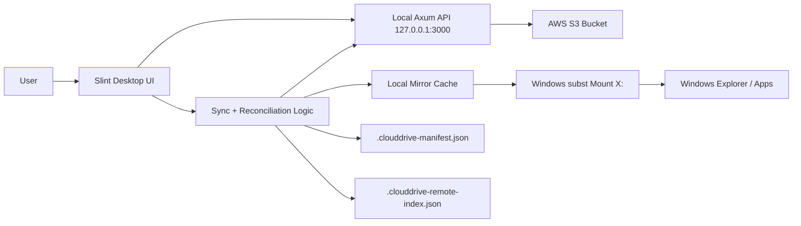

# CloudDrive

An S3-backed desktop cloud sync drive built in Rust with a native Slint UI, a local Axum backend, and a Windows-mounted cache that behaves like a personal mirrored drive.

This project focuses on the engineering problem behind desktop cloud storage clients: presenting remote object storage through a familiar file-browser workflow while keeping the implementation local-first, observable, and extensible.

## UI Snapshot


## What This Project Does

- Browses objects stored in AWS S3 through a desktop UI.
- Simulates folders over S3's flat key-value model by parsing object keys on the client.
- Uploads files and folders from the desktop to S3.
- Downloads and deletes files through a local backend.
- Mirrors remote S3 content into a local cache directory.
- Mounts that cache directory as a Windows drive letter using `subst`.
- Tracks local and remote metadata to support reconciliation during sync.

## What Makes This Interesting

CloudDrive is not just a file browser. It is a small desktop systems project that combines:

- Native desktop UI development with Slint.
- Embedded local service design with Axum.
- Object-storage integration with the AWS Rust SDK.
- Drive-mount behavior on Windows.
- Sync metadata management through manifests and remote indexes.
- A practical translation layer between hierarchical file UX and flat object storage.

## System Design



### Architecture Overview

`CloudDrive` is implemented as a single Rust desktop application with two cooperating layers inside one process:

1. `Slint UI layer`
   Presents the drive view, search, folder navigation, upload controls, sync actions, and drive mount status.

2. `Local Axum backend`
   Runs on `127.0.0.1:3000` and exposes a narrow internal API for:
   - listing S3 objects
   - uploading file bodies to S3
   - downloading object contents
   - deleting remote objects

The UI talks to the backend over local HTTP. This separation is useful because it keeps cloud operations isolated behind a stable interface and makes the sync path easier to reason about and test.

## Core Design Decisions

### 1. S3 Is Flat, the UI Is Hierarchical

S3 stores objects as flat keys, but users expect folders. CloudDrive resolves that mismatch client-side by interpreting key prefixes such as:

`documents/reports/q1.pdf`

as a navigable hierarchy:

- `documents/`
- `documents/reports/`
- `documents/reports/q1.pdf`

This gives the user an intuitive drive-like browsing experience without requiring server-side path resolution.

### 2. Localhost API as an Internal Service Boundary

Instead of letting the UI call the AWS SDK directly, the app spawns a local Axum server. That gives the design a clean separation between:

- presentation and interaction logic
- storage and transfer logic

It also makes the architecture extensible. The same UI contract could later sit in front of another provider such as Google Drive, MinIO, or a custom object store.

### 3. Mirror Cache + Mounted Drive Letter

The current implementation uses a local cache directory as the source of truth for the mounted Windows drive. That directory is exposed as a drive letter via `subst`, which is a pragmatic way to make the synced data feel drive-like in Explorer.

This is deliberately a mirrored-drive design, not a streamed virtual filesystem. Files are materialized into the cache during sync rather than hydrated on demand.

### 4. Metadata-Driven Reconciliation

The sync engine persists two pieces of local metadata:

- `.clouddrive-manifest.json`
  Records the last known local file state used to detect local changes.

- `.clouddrive-remote-index.json`
  Caches remote object metadata such as size, type, modified time, and ETag.

This allows the app to compare:

- what exists locally
- what previously existed locally
- what exists remotely

and then decide which files to upload, download, or delete.

## Sync Flow

During a sync cycle, the application follows this sequence:

1. Ensure the local cache directory exists.
2. Verify that the drive letter is mounted.
3. Load the previous local manifest.
4. Scan the local cache recursively.
5. Upload local files whose size or modified timestamp changed.
6. Delete remote objects that were present in the manifest but no longer exist locally.
7. Fetch the current remote object list from S3.
8. Download all valid remote objects into the local cache.
9. Remove stale local files that no longer exist remotely.
10. Rebuild and persist the local manifest.

This gives the project deterministic mirror-mode behavior and keeps the mounted drive aligned with S3 after each sync.

## Request and Data Flow

### Browse Flow

1. The Slint UI requests `/files` from the local Axum service.
2. Axum lists objects from S3.
3. The UI converts flat keys into visible folder and file entries.
4. The rendered table updates based on the current prefix and search query.

### Upload Flow

1. The user selects a file or folder from the desktop.
2. The UI builds multipart form data.
3. The local Axum backend receives the upload.
4. The backend writes the object directly to S3.
5. The UI refreshes the object list and metadata cache.

### Drive Sync Flow

1. The UI triggers mount or sync.
2. The app mounts the local cache as a Windows drive letter.
3. The reconciliation logic compares manifest, local cache, and remote index.
4. S3 changes are mirrored into the cache.
5. The drive letter reflects the synchronized local cache contents.

## Project Structure

```text
.
+-- Cargo.toml
+-- build.rs
+-- docs/
|   +-- streaming-drive-roadmap.md
+-- src/
|   +-- main.rs           # UI orchestration, refresh, upload/download, sync logic
|   +-- server.rs         # Local Axum API backed by AWS S3
|   +-- virtual_drive.rs  # Cache management, manifest/index persistence, drive mount
|   `-- s3.rs             # Reserved for future storage abstraction
`-- ui/
    `-- app.slint         # Native desktop interface
```

## Running the Project

### Prerequisites

- Rust toolchain
- Windows if you want drive mount support
- AWS credentials available through the standard AWS SDK credential chain
- An S3 bucket

### Environment

Create a `.env` file with:

```env
S3_BUCKET=your-bucket-name
```

### Start

```bash
cargo run
```

The application will:

- compile the Slint UI
- start the local Axum backend on `localhost:3000`
- open the desktop interface

## Current Scope

This project currently implements a `cloud sync drive` in mirror mode.

That means:

- the mounted drive is backed by a real local cache directory
- sync explicitly copies data between S3 and the cache
- Windows sees a mounted local folder, not a custom filesystem provider

## Limitations

- It is not yet a true on-demand virtual filesystem.
- The mounted drive uses `subst`, so it depends on a local mirrored cache.
- Remote changes are synchronized through explicit refresh and sync actions.
- Large buckets will eventually need paginated listing and more selective sync behavior.
- Streamed reads, placeholder files, and partial hydration are not implemented yet.

## Roadmap Toward a True Streamed Drive

The next architectural step would be replacing the mirrored `subst` approach with a real filesystem provider such as:

- Windows Cloud Files API for a sync-root model
- WinFsp or Dokany for a true drive-letter-based virtual filesystem

That would unlock:

- placeholder files
- on-demand hydration
- ranged reads for large objects
- background sync services
- richer Explorer integration

The current `docs/streaming-drive-roadmap.md` documents that path in more detail.

## Interview Talking Points

- Why a local HTTP boundary can simplify desktop architecture.
- How to map hierarchical UX onto flat object storage safely.
- Why manifests and remote indexes matter in sync systems.
- The tradeoff between shipping a mirrored-drive prototype quickly and building a true virtual filesystem provider.
- What would need to change to evolve this into Google Drive style streaming mode.

## Tech Stack

- Rust
- Slint
- Axum
- Tokio
- Reqwest
- AWS SDK for Rust
- AWS S3

## Summary

CloudDrive is a systems-oriented desktop application that turns S3-backed object storage into a user-friendly cloud sync experience. It demonstrates full-stack Rust development across UI, local services, metadata management, sync orchestration, and OS-level drive mounting, while also showing clear awareness of the boundary between a mirrored sync drive and a true virtual filesystem.
